# 高性能リサーチ AIBot 「[Fairy](https://fairy.krz-tech.net)」

HoyoverseのアクションRPG「ゼンレスゾーンゼロ」に登場するFairyというAIアシスタントをモチーフにしたリサーチAIBot。Discord上で簡易的なリサーチ結果を確認でき、より詳細な情報や参照URLなどを発行されたURLからブラウザ上で閲覧可能。URLを共有することでDiscord外でもリサーチ結果を共有することができる。

## デプロイ先

Fairy -> https://fairy.krz-tech.net

## 使い方

* Discord上で`@fairy Zenless Zone Zero`のように入力してください。
* Fairyがホロウを探索して情報を収集します。
* 探索が完了し、生成した回答が返答されます。また、より詳細な情報や参照したサイトのURLは外部リンクからアクセスすることができます。

## 利用規約

* **Gemini APIの利用**: 情報収集・分析のためにGoogle Gemini APIを使用します。
* **データの保存**: リサーチ結果や会話データは、サービスの品質向上および履歴管理のために保存されます。
* **免責事項**: 生成された情報の正確性について保証するものではありません。

## 技術構成

### Discord

* Python
    * discord.py

### Web (Frontend)

* Vue.js (Vite)
    * Tabler Icons

### Web & Discord (Backend)

* Python
    * FastAPI
    * Ollama
    * MongoDB (NoSQL)
    * Google Gemini 2.5 Flash Lite

### Local-LLM

* Ollama
      * Gemma 3 1B

## 処理フロー

```mermaid
sequenceDiagram
    participant User as User (Discord)
    participant Bot as Discord Bot
    participant API as Backend API
    participant Ollama as Ollama (Local LLM)
    participant Gemini as Gemini API (Google)
    participant DB as MongoDB
    participant Web as Frontend (Web)

    User->>Bot: Mention (@fairy keyword)
    Bot->>API: POST /v2/research (keyword)
    
    rect rgb(20, 20, 20)
        Note over API, Ollama: Stage 0: Keyword Extraction
        API->>Ollama: Extract keywords (Gemma 3 1B)
        Ollama-->>API: Extracted Keywords
    end

    rect rgb(30, 30, 30)
        Note over API, Gemini: Stage 1: Research
        API->>Gemini: Perform Research (Google Search Tool)
        Gemini-->>API: Research Report & URLs
    end

    rect rgb(40, 40, 40)
        Note over API, Gemini: Stage 2: Encoding (Persona)
        API->>Gemini: Format Response (Fairy Persona)
        Gemini-->>API: JSON (Smart & Full Message)
    end

    API->>DB: Save Research Result
    API-->>Bot: Return JSON Result
    Bot-->>User: Reply with Smart Message & Link
    
    User->>Web: Click Link (View Full Report)
    Web->>API: GET /v2/research/{uuid}
    API-->>Web: Return Full Research Data
    Web-->>User: Display Formatted Report
```

